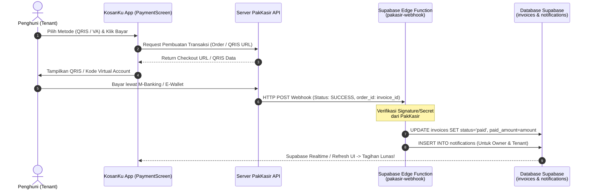

# Panduan Lengkap Implementasi Otomatis Payment Gateway PakKasir di KosanKu

Dokumen ini adalah panduan lengkap langkah-demi-langkah untuk mengintegrasikan **PakKasir** (Payment Gateway Indonesia) dengan aplikasi **KosanKu** secara otomatis dan *real-time*.

Dengan arsitektur ini, ketika penghuni (Tenant) melakukan pembayaran tagihan melalui **QRIS**, **Virtual Account Bank (BCA, BRI, BNI, Mandiri)**, atau **E-Wallet (GoPay, OVO, DANA)**, sistem akan secara otomatis memverifikasi pembayaran dalam hitungan detik (*tanpa persetujuan manual Owner*) dan mengubah status invoice menjadi **LUNAS (Paid)**.

---

## 🏛️ Arsitektur Integrasi (Server-to-Server)

Karena aplikasi mobile tidak boleh menyimpan *Secret Key* payment gateway secara langsung di *client-side* demi keamanan, kita menggunakan kombinasi **React Native (Client)** + **Supabase Edge Functions (Backend Webhook)**.



---

## 🚀 Langkah 1: Konfigurasi Akun & Proyek PakKasir

1. **Daftar & Login ke Dashboard PakKasir:**
   Buka [https://app.pakasir.com](https://app.pakasir.com) dan buat akun atau login menggunakan akun bisnis/pribadi Anda.
2. **Buat Proyek Baru (*Project*):**
   - Klik menu **Proyek Saya (My Projects)** -> **Tambah Proyek Baru**.
   - Masukkan nama proyek: `KosanKu App`.
3. **Ambil API Key & Secret Key:**
   - Masuk ke detail proyek yang baru dibuat.
   - Salin **Project Slug / API Key** dan **Secret Key** Anda. Simpan di tempat yang aman.
4. **Atur Webhook URL (URL Notifikasi Otomatis):**
   - Pada halaman **Edit Proyek**, cari kolom **Webhook URL** atau **URL Callback**.
   - Masukkan URL endpoint Supabase Edge Function Anda (kita akan membuatnya di Langkah 2):
     `https://[PROJECT_ID_SUPABASE].supabase.co/functions/v1/pakasir-webhook`
   - Klik **Simpan Proyek**.

---

## ⚡ Langkah 2: Pembuatan Supabase Edge Function (`pakasir-webhook`)

Supabase Edge Function berfungsi untuk menerima laporan pembayaran sukses dari server PakKasir seketika (`real-time`), memverifikasi keamanannya, dan mengupdate status tagihan di database KosanKu.

### 1. Buat File Edge Function
Jika Anda menggunakan Supabase CLI di terminal:
```bash
npx supabase functions new pakasir-webhook
```

### 2. Kode Utama `pakasir-webhook/index.ts`
Salin dan gunakan skrip TypeScript berikut ke dalam file `supabase/functions/pakasir-webhook/index.ts`:

```typescript
// supabase/functions/pakasir-webhook/index.ts
import { serve } from "https://deno.land/std@0.168.0/http/server.ts";
import { createClient } from "https://esm.sh/@supabase/supabase-js@2.39.0";

const PAKKASIR_SECRET_KEY = Deno.env.get("PAKKASIR_SECRET_KEY") || "SECRET_KEY_ANDA";
const SUPABASE_URL = Deno.env.get("SUPABASE_URL") || "";
const SUPABASE_SERVICE_ROLE_KEY = Deno.env.get("SUPABASE_SERVICE_ROLE_KEY") || "";

serve(async (req) => {
  // Hanya terima method POST dari server PakKasir
  if (req.method !== "POST") {
    return new Response(JSON.stringify({ error: "Method not allowed" }), {
      status: 405,
      headers: { "Content-Type": "application/json" },
    });
  }

  try {
    const payload = await req.json();
    console.log("📥 Menerima Webhook PakKasir:", payload);

    // 1. Ekstrak data penting dari payload PakKasir
    // (Sesuaikan nama field persis dengan format spesifikasi PakKasir terbaru)
    const {
      order_id,      // Ini adalah UUID invoice kita (invoices.id)
      status,        // 'completed', 'success', atau 'paid'
      amount,        // Nominal yang dibayar
      transaction_id,
      signature,     // Kode verifikasi keamanan
    } = payload;

    // 2. Verifikasi keamanan (Opsional tapi SANGAT DIANJURKAN agar tidak di-spoofing)
    // Contoh verifikasi sederhana jika PakKasir mengirimkan token secret di header:
    const authHeader = req.headers.get("x-callback-token") || req.headers.get("authorization");
    if (authHeader !== PAKKASIR_SECRET_KEY && !signature) {
      console.error("❌ Verifikasi Webhook Gagal: Secret key tidak valid");
      return new Response(JSON.stringify({ error: "Unauthorized" }), { status: 401 });
    }

    // 3. Cek apakah status pembayaran sukses
    if (status === "completed" || status === "success" || status === "paid") {
      const supabase = createClient(SUPABASE_URL, SUPABASE_SERVICE_ROLE_KEY);

      // Ambil invoice terkait untuk pengecekan nominal
      const { data: invoice, error: fetchErr } = await supabase
        .from("invoices")
        .select("id, total_amount, paid_amount, tenant_id, owner_id, invoice_number, contracts(rooms(room_number, properties(name)))")
        .eq("id", order_id)
        .single();

      if (fetchErr || !invoice) {
        console.error("❌ Invoice tidak ditemukan:", order_id);
        return new Response(JSON.stringify({ error: "Invoice not found" }), { status: 404 });
      }

      const newPaidAmount = parseFloat(amount || invoice.total_amount);
      const isFullPayment = newPaidAmount >= parseFloat(invoice.total_amount);
      const newStatus = isFullPayment ? "paid" : "partial";

      // 4. Update status Invoice di Database secara otomatis
      const { error: updateErr } = await supabase
        .from("invoices")
        .update({
          status: newStatus,
          paid_amount: newPaidAmount,
          payment_gateway_order_id: transaction_id || order_id,
          updated_at: new Date().toISOString(),
        })
        .eq("id", order_id);

      if (updateErr) {
        console.error("❌ Gagal update database invoice:", updateErr);
        throw updateErr;
      }

      console.log(`✅ Invoice ${invoice.invoice_number} berhasil diubah menjadi: ${newStatus.toUpperCase()}`);

      // 5. Kirim Notifikasi Real-Time ke Owner & Tenant
      const propName = invoice.contracts?.rooms?.properties?.name || "Kosan";
      const roomNum = invoice.contracts?.rooms?.room_number || "";
      const formattedAmt = new Intl.NumberFormat("id-ID", { style: "currency", currency: "IDR", minimumFractionDigits: 0 }).format(newPaidAmount);

      const notifications = [
        // Notifikasi untuk Tenant (Penghuni)
        {
          user_id: invoice.tenant_id,
          title: "Pembayaran Berhasil! 🎉",
          body: `Pembayaran tagihan ${invoice.invoice_number} (Kamar ${roomNum} di ${propName}) sebesar ${formattedAmt} telah dikonfirmasi otomatis. Terima kasih!`,
          type: "invoice_paid",
          reference_id: invoice.id,
          reference_type: "invoice",
          is_read: false,
        },
        // Notifikasi untuk Owner (Pemilik)
        {
          user_id: invoice.owner_id,
          title: "Dana Pembayaran Masuk 💰",
          body: `Penghuni kamar ${roomNum} (${propName}) telah membayar tagihan ${invoice.invoice_number} sebesar ${formattedAmt} via PakKasir.`,
          type: "invoice_paid",
          reference_id: invoice.id,
          reference_type: "invoice",
          is_read: false,
        },
      ];

      await supabase.from("notifications").insert(notifications);
    }

    // Selalu balas 200 OK ke server PakKasir agar mereka tahu webhook sukses diterima
    return new Response(JSON.stringify({ success: true, message: "Webhook processed" }), {
      status: 200,
      headers: { "Content-Type": "application/json" },
    });
  } catch (err) {
    console.error("❌ Error internal webhook:", err);
    return new Response(JSON.stringify({ error: err.message }), { status: 500 });
  }
});
```

### 3. Deploy dan Set Environment Variable di Supabase
Jalankan perintah berikut di terminal untuk mendeploy dan memasukkan *Secret Key*:
```bash
npx supabase secrets set PAKKASIR_SECRET_KEY="SECRET_KEY_DARI_DASHBOARD_PAKKASIR"
npx supabase functions deploy pakasir-webhook --no-verify-jwt
```
*(Catatan: `--no-verify-jwt` wajib ditambahkan karena Webhook ini dipanggil oleh server eksternal PakKasir, bukan oleh pengguna yang sedang login).*

---

## 📱 Langkah 3: Layanan & Komponen Pembayaran di Frontend (`src/services/pakkasirService.js`)

Untuk mempermudah integrasi dari `PaymentScreen.jsx`, buat service khusus `pakkasirService.js` yang menangani pembuatan link pembayaran / QRIS.

```javascript
// src/services/pakkasirService.js
import supabaseClient from './supabaseClient';

const PAKKASIR_API_BASE_URL = 'https://api.pakasir.com/v1'; // Sesuaikan dengan base URL resmi
const PROJECT_SLUG = 'kosanku-project'; // Slug proyek Anda di PakKasir

/**
 * Membuat transaksi baru di PakKasir dan mengembalikan link pembayaran / QR Code
 */
export const createPakKasirTransaction = async ({ invoice, tenant, paymentMethod }) => {
  try {
    const orderId = invoice.id;
    const amount = parseFloat(invoice.total_amount) - parseFloat(invoice.paid_amount || 0);

    // Payload request ke API PakKasir
    const payload = {
      project: PROJECT_SLUG,
      order_id: orderId,
      amount: amount,
      method: paymentMethod || 'qris', // 'qris', 'bca_va', 'bri_va', 'gopay', dll.
      customer_name: tenant?.full_name || 'Penghuni KosanKu',
      customer_email: tenant?.email || '',
      callback_url: `https://app.kosanku.com/payment/success?invoice_id=${orderId}`,
    };

    const response = await fetch(`${PAKKASIR_API_BASE_URL}/transaction/create`, {
      method: 'POST',
      headers: {
        'Content-Type': 'application/json',
      },
      body: JSON.stringify(payload),
    });

    const data = await response.json();

    if (!response.ok || data.error) {
      throw new Error(data.message || 'Gagal membuat transaksi pembayaran PakKasir');
    }

    return {
      success: true,
      paymentUrl: data.payment_url, // URL untuk WebView atau Checkout
      qrisUrl: data.qris_image_url, // URL gambar QRIS (jika metode QRIS)
      vaNumber: data.va_number,     // Nomor VA (jika metode VA)
    };
  } catch (error) {
    console.error('Error createPakKasirTransaction:', error);
    return { success: false, error: error.message };
  }
};
```

---

## 🎯 Langkah 4: Pengalaman Pengguna (UX) yang Disarankan di `PaymentScreen.jsx`

Ketika pengguna menekan tombol **Bayar Sekarang**:

1. **Pemilihan Mode Pembayaran:**
   - **Mode Otomatis (PakKasir):** Menampilkan QRIS statis/dinamis yang siap di-scan langsung menggunakan kamera M-Banking / GoPay / DANA, atau nomor Virtual Account yang bisa disalin cukup dengan satu tombol tekan (*Copy VA Number*).
   - **Mode Manual / Bayar Tunai (*Fallback*):** Tetap menyediakan opsi bayar langsung ke pemilik kos untuk kenyamanan penghuni yang tidak memiliki rekening.
2. **Indikator Menunggu Pembayaran & Polling Real-time:**
   Setelah penghuni menyalin nomor VA atau melihat QRIS, aplikasi menampilkan banner animasi bersinar:
   > ⏳ *"Menunggu Pembayaran... Sistem akan memverifikasi pembayaran Anda secara otomatis dalam hitungan detik setelah transfer selesai."*
3. **Efek Konfirmasi Otomatis:**
   Begitu *Webhook* dari PakKasir masuk ke server Supabase dan mengubah status invoice menjadi `paid`, `PaymentScreen` (yang mendengarkan Supabase Realtime / secara berkala mengecek status) akan langsung menampilkan modal perayaan sukses (`Pembayaran Berhasil! 🎉`) tanpa perlu klik apapun lagi dari pengguna!

---

## 📦 Ringkasan Manfaat Integrasi Ini
- **0 Administrasi Manual:** Owner tidak perlu lagi mengecek mutasi rekening bank secara manual satu per satu setiap awal bulan.
- **24/7 Real-Time:** Penghuni bisa bayar jam 2 pagi sekalipun dan tagihan mereka akan otomatis terverifikasi lunas dalam hitungan detik.
- **Keamanan Tinggi:** Signature webhook diverifikasi secara ketat di Supabase Edge Function, mencegah manipulasi atau pembayaran fiktif.
