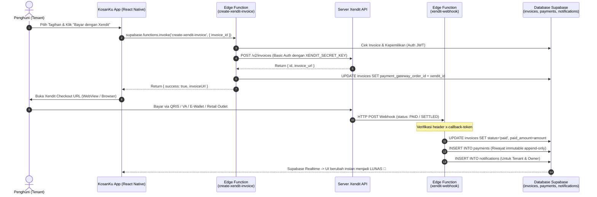

# Panduan Lengkap Implementasi Payment Gateway Xendit (Server-to-Server) di KosanKu

Dokumen ini adalah panduan langkah-demi-langkah integrasi **Xendit** dengan aplikasi **KosanKu** menggunakan arsitektur **Server-to-Server (React Native + Supabase Edge Functions)** agar *Secret Key* Xendit tetap aman dan tidak bocor ke aplikasi *client-side*.

---

## 🏛️ Arsitektur Keamanan & Alur Pembayaran

Sesuai standar keamanan dan aturan proyek KosanKu (*Security First & Supabase Database/RLS as Source of Truth*):
- **Aplikasi React Native (Frontend)**: Hanya bertugas memanggil Supabase Edge Function (`create-xendit-invoice`) dengan menyertakan token JWT autentikasi penghuni kos, lalu membuka tautan *Checkout URL* resmi dari Xendit via `WebView` atau Browser (`Linking.openURL`).
- **Supabase Edge Function (`create-xendit-invoice`)**: Mengecek kepemilikan tagihan di database PostgreSQL menggunakan *Service Role*, lalu membuat invoice di API Xendit menggunakan *Secret Key* yang tersimpan di rahasia Supabase (`Deno.env`).
- **Supabase Edge Function (`xendit-webhook`)**: Endpoint terbuka (`--no-verify-jwt`) yang bertugas menerima laporan otomatis (*Callback/Webhook*) langsung dari server Xendit saat pembayaran sukses (`PAID`), memverifikasi *Callback Token*, mengubah status tagihan di tabel `invoices` menjadi `paid`, mencatat log di tabel `payments`, serta mengirim `notifications` *Real-Time* ke Tenant dan Owner.



---

## ⚡ Langkah 1: Masukkan Secret Key ke Supabase Secrets

Karena Anda sudah mendapatkan *Secret Key* dari Dashboard Xendit, simpan kunci tersebut ke server Supabase Anda dengan menjalankan perintah berikut di terminal (dalam folder proyek `KosanKu`):

```bash
# 1. Masukkan Secret Key Xendit (awalan xnd_development_... atau xnd_production_...)
npx supabase secrets set XENDIT_SECRET_KEY="xnd_development_xxxxxxxxxxxxxxxxxxxxxxxxxxx"

# 2. Masukkan Verification / Callback Token (ambil di Dashboard Xendit -> Settings -> Callbacks)
npx supabase secrets set XENDIT_CALLBACK_TOKEN="xxxxxxxxxxxxxxxxxxxxxxxxxxx"
```

---

## 🚀 Langkah 2: Deploy Edge Functions ke Supabase

Dua Edge Function telah dibuat di dalam repository ini:
1. `supabase/functions/create-xendit-invoice/index.ts`
2. `supabase/functions/xendit-webhook/index.ts`

Deploy keduanya ke server Supabase Anda menggunakan perintah CLI:

```bash
# Deploy fungsi pembuatan invoice (wajib membutuhkan JWT user dari aplikasi)
npx supabase functions deploy create-xendit-invoice

# Deploy fungsi webhook (wajib --no-verify-jwt agar server eksternal Xendit bisa mengirim callback)
npx supabase functions deploy xendit-webhook --no-verify-jwt
```

---

## 🌐 Langkah 3: Daftarkan URL Webhook di Dashboard Xendit

Agar Xendit otomatis melapor ke Supabase saat penghuni selesai membayar:
1. Buka [https://dashboard.xendit.co](https://dashboard.xendit.co) dan login.
2. Masuk ke menu **Settings** > **Callbacks** (atau **Webhooks**).
3. Pada bagian **Invoice Paid / Invoice Settled**, masukkan URL endpoint Supabase Edge Function Anda:
   ```
   https://[PROJECT_ID_SUPABASE].supabase.co/functions/v1/xendit-webhook
   ```
   *(Ganti `[PROJECT_ID_SUPABASE]` dengan ID proyek Supabase Anda yang ada di file `.env` atau Dashboard Supabase).*
4. Klik tombol **Test and Save**. Pastikan respons yang dikembalikan adalah **200 OK**.

---

## 📱 Langkah 4: Penggunaan di Aplikasi React Native

Fungsi helper telah disediakan di `src/services/xenditService.js`. Berikut adalah contoh cara memasang tombol pembayaran dan mendengarkan pembaruan status *Real-Time* di komponen `PaymentScreen.jsx` Anda:

```javascript
import React, { useEffect, useState } from 'react';
import { View, Text, TouchableOpacity, Alert, Linking, ActivityIndicator } from 'react-native';
import { createXenditCheckout, subscribeToInvoiceRealtime } from '../services/xenditService';

export default function PaymentScreen({ route, navigation }) {
  const { invoice } = route.params;
  const [loading, setLoading] = useState(false);
  const [status, setStatus] = useState(invoice.status);

  // Supabase Realtime - Dengarkan perubahan status invoice secara instan
  useEffect(() => {
    const subscription = subscribeToInvoiceRealtime(invoice.id, (updatedInvoice) => {
      setStatus(updatedInvoice.status);
      if (updatedInvoice.status === 'paid') {
        Alert.alert(
          '🎉 Pembayaran Berhasil!',
          'Tagihan kos Anda telah dikonfirmasi lunas oleh sistem secara otomatis.'
        );
      }
    });

    return () => {
      if (subscription) subscription.unsubscribe();
    };
  }, [invoice.id]);

  const handlePayWithXendit = async () => {
    setLoading(true);
    const result = await createXenditCheckout(invoice.id);
    setLoading(false);

    if (result.success && result.invoiceUrl) {
      // Buka browser / WebView ke halaman checkout Xendit (menyediakan pilihan QRIS, VA, E-Wallet)
      Linking.openURL(result.invoiceUrl);
    } else {
      Alert.alert('Gagal Memulai Pembayaran', result.error || 'Terjadi kesalahan sistem.');
    }
  };

  return (
    <View style={{ padding: 20 }}>
      <Text style={{ fontSize: 18, fontWeight: 'bold' }}>Tagihan: {invoice.invoice_number}</Text>
      <Text style={{ marginTop: 8 }}>Total: Rp {Number(invoice.total_amount).toLocaleString('id-ID')}</Text>
      <Text style={{ marginTop: 8 }}>Status: {status.toUpperCase()}</Text>

      {status !== 'paid' ? (
        <TouchableOpacity
          onPress={handlePayWithXendit}
          disabled={loading}
          style={{
            backgroundColor: '#1E40AF',
            padding: 14,
            borderRadius: 8,
            alignItems: 'center',
            marginTop: 24,
          }}
        >
          {loading ? (
            <ActivityIndicator color="#fff" />
          ) : (
            <Text style={{ color: '#fff', fontWeight: 'bold', fontSize: 16 }}>Bayar Sekarang (Xendit)</Text>
          )}
        </TouchableOpacity>
      ) : (
        <View style={{ backgroundColor: '#D1FAE5', padding: 14, borderRadius: 8, marginTop: 24 }}>
          <Text style={{ color: '#065F46', fontWeight: 'bold', textAlign: 'center' }}>
            ✅ TAGIHAN INI TELAH LUNAS
          </Text>
        </View>
      )}
    </View>
  );
}
```

---

## 🔒 Ringkasan Keamanan & Kepatuhan Proyek
- **Tidak ada Secret Key di `.env` frontend atau kode aplikasi HP:** Mengikuti aturan ketat pengumpulan/tugas akhir KosanKu.
- **Row Level Security (RLS) Tetap Dijaga:** Skrip `create-xendit-invoice` mengecek identitas pemanggil melalui header `Authorization: Bearer <JWT>`, sehingga pengguna lain tidak bisa membuat invoice untuk tagihan yang bukan miliknya.
- **Log Pembayaran Immutable:** Webhook mencatat setiap transaksi sukses ke dalam tabel `payments` (yang bersifat *append-only* di RLS) untuk rekam jejak audit pemilik kos.
